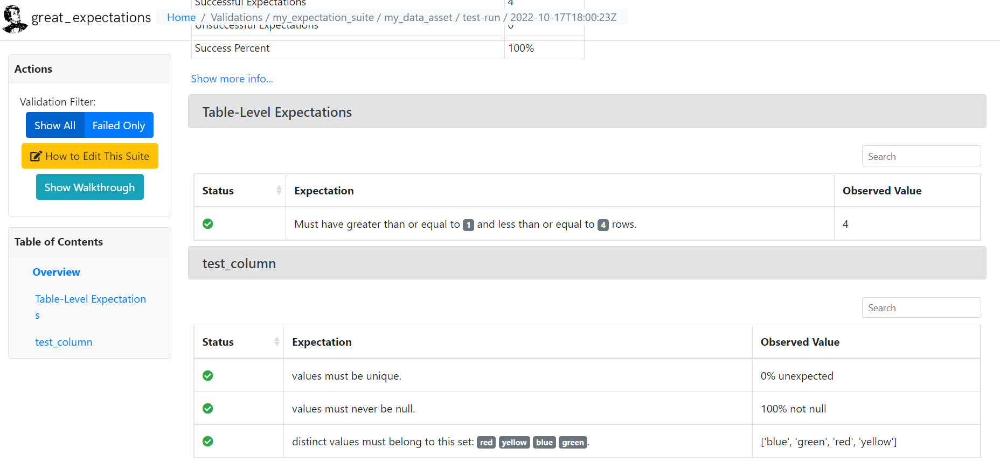

# Great Expectations Lambda
Build a serverless and event-driven data quality system with AWS Lambda and Great Expectations

## 📜 Table of Contents
- [About](#about)
- [Getting Started](#getting_started)
- [Usage](#usage)
- [Deploy](#deploy)
- [Built Using](#built_using)
- [Authors](#authors)

<br />

## 🧐 About <a name = "about"></a>
**Great Expectations** is an open-source data quality framework based on Python. GE enables engineers to write tests, review reports, and assess the quality of data. 
It is a plugable tool, meaning you can easily add new expectations and customize final reports.

**AWS Lambda** is a serverless, event-driven compute service that lets you run code for virtually any type of application or backend service without provisioning or managing servers.

Unfortunately, AWS Lambda imposes certain quotas and limits on the size of the deployment package:
- **50 MB** (zipped, for direct upload) 
- **250 MB** (unzipped). This quota applies to all the files you upload, including layers and custom runtimes.

As a result, deploying GE on lambda takes some ingenuity. However,
we can solve this problem packaging and deploying Lambda functions as container images of up to **10 GB** in size
<br />

## 🏁 Getting Started <a name = "getting_started"></a>

Install packages in the virtualenv:

```
pipenv install --dev
```
<br />

## 💻 Usage <a name="usage"></a>

### 👀  Pre-requisites ###
Make sure to have Docker installed
```
docker --version
```

<br />

Run the following script to build the docker image, run the container and locally test the lambda function (AWS account not needed)
```
script/docker.sh
```

<br />

Run the following script to locally export the HTML documentation generated by Great Expectations. If no local path is specified ```C:/great_expectations_data_docs/``` will be used as default

```
script/export_data_docs.sh example/local/path
```

<br />

Go to the exported folder and open the ```index.html``` file




<br />

## 🚀 Deploy <a name = "deploy"></a>
I personally recommend [Serverless](https://www.serverless.com/) to deploy lambda functions.
Alternatively, in the ```infra``` folder you can find a Terraform example to create the AWS infrastructure and in the ```script``` folder an example to tag and push the docker image to Amazon ECR

```
script/naive_deploy.sh
```

<br />

## ⛏️ Built Using <a name = "built_using"></a>
- [Python](https://www.python.org/) | Programming language
- [Pipenv](https://pipenv.pypa.io/en/latest/) | Dependency management
- [Pre-Commit](https://pre-commit.com/) | Managing and maintaining hooks
- [Github Actions](https://github.com/features/actions) | CI/CD
- [Terraform](https://www.terraform.io/) | Infrastructure as Code
- [Docker](https://www.docker.com/) | Containerization and Deploy
- [python-lambda-local](https://github.com/HDE/python-lambda-local) | Run AWS lambda function on local machine
- [great_expectations](https://greatexpectations.io/) | Data Quality tool
- [AWS lambda function](https://aws.amazon.com/lambda/) | Serverless compute service
- [Unix shell]() | Command-line interpreter

<br />

## ✏️ Authors <a name = "authors"></a>
- Made with ❤️  by [@vittoriopolverino](https://github.com/vittoriopolverino)
